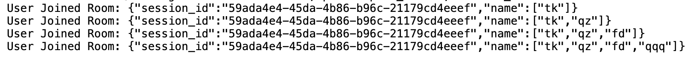

# Movie Swipe App

## Introduction
This is the final project for CS506. The app allows friends to **(`start a session/join a group`)** and use a Tinder-like swiping mechanism to vote for which movie to watch together. The goal is to make movie selection fun, interactive, and democratic among friends. ~~movies.db being used is put in the **google drive CS506** (`Project/Setup tables in Database/movies.db`)~~, ~~also since the **session_route_html_test is too large to push**, put in CS506 (`Project/session_route_html_test`)~~ , a new compiled version of all the html functionalities for testing use the name is called **(`complete_version_html_testing.html`)**, a new structured database will be in **google drive CS506** **(`Project/Setup tables in Database/UPDATED DATABASE/movies_v2.db`)**

## Version Control
- Python Version: Conda 3.10.0
- Install dependencies using:
  ```sh
  pip install -r requirements.txt
  ```

## Setup Instructions
1. Clone the repository:
   ```sh
   git clone https://github.com/Steal-Your-Data/backend.git
   ```
2. Create and activate a Conda environment (optional but recommended):
   ```sh
   conda create --name movie-swipe-app python=3.10.0
   conda activate movie-swipe-app
   ```
3. Install dependencies:
   ```sh
   pip install -r requirements.txt
   ```
4. Run the application:
   ```sh
   python app.py
   ```

## High Level Workflow Diagram


## Potential Modification of the Database
---

### 1. Update the `MoviePocket` Model in `models.py`

Since we need to implement add functions when we encounter a case where there is no such a movies in the database. Thus there will be slightly modification on the code.

Firstly, Modify the `MoviePocket` class in your Flask application to include the new columns:

```python
from flask_sqlalchemy import SQLAlchemy

db = SQLAlchemy()

class MoviePocket(db.Model):
    __tablename__ = 'movie_pocket'
    id = db.Column(db.Integer, primary_key=True)
    session_id = db.Column(db.Text, db.ForeignKey('session.id'), nullable=False)
    movie_id = db.Column(db.Integer, db.ForeignKey('movies.id'))
    votes = db.Column(db.Integer, default=0)

    # New columns (nullable)
    title = db.Column(db.String(100))
    genres = db.Column(db.String(100))
    original_language = db.Column(db.String(10))
    overview = db.Column(db.Text)
    popularity = db.Column(db.Float)
    release_date = db.Column(db.Date)
    poster_path = db.Column(db.String(200))
```

In the database (`movies_v2.db`), also please change the table

```sqlite3
-- Drop the existing table if it exists
DROP TABLE IF EXISTS movie_pocket;

-- Create the new table with updated schema
CREATE TABLE movie_pocket (
    id INTEGER PRIMARY KEY,
    session_id TEXT NOT NULL REFERENCES session(id),
    movie_id INTEGER REFERENCES movies(id),
    votes INTEGER DEFAULT 0,
    title TEXT,
    genres TEXT,
    original_language TEXT,
    overview TEXT,
    popularity REAL,
    release_date DATE,
    poster_path TEXT
);
```

And also You might change the add_movies API in session_routes.py accordingly

## Updates 3/2/2025

Fixing/Solving some potential inconvenience for the front-end guys. In (`socket_events.py`). Previously, the function called (`handle_join_session_room()`) only emit messages about which user joining the session, but not a whole list of people in this session. This will cause inconvenience when We update the joining guest list in the frontend. Since they need to call twice firstly when they join they will call (`list_participants()`) in session_routes.py and then they need to listen to SocketIO broadcast to add other person who are newly joining the session one by one, which might be inconvenient to impelement in the front end. Thus the newly (`socket_events.py`) is a compiled version of it. In the frontend, only need to listen to socket events **join_session_room**, then you will get the updated session participants list in the session. Though the cost is a bit high in the frontend, but considering for one session, probably there will only be 8 - 9 people at maximum, it is not a big deal to update the list 8 to 9 times.

Below are the new logs, once we hit the join_room button under Socket.IO Actions in .html file called (`complete_version_html_testing.html`)



## Updates 3/6/2025

Updated the model.py to have string id instead and ensured randomly generating a new session id so duplicate error does not occur anymore


## Updates 3/28/2025

Updated the **folder (`test/`)** for doing basic unit testing for each API, bascially for **corner case** testing. This test aims to build a very decent fault-tolerance system. There are total of 50 test cases for testing the APIs' fault-tolerance ability. Based on the test cases, Modifying the APIs a little bit handling invalid input. But still using **(`complete_version_html_testing.html`)** for testing if each APIs is working good after modifying the current APIs. As a result, current APIs in this branch pass both **folder (`test/`)** and **(`complete_version_html_testing.html`)**. To simply run the unit test just in the backend folder and open terminal run **(`pytest`)** 

## Updates 4/2/2025


Finished updating the movie_routes.py below are the new routes I added to the repo:


(`/search_API`):Searches movies via TMDb API.
(`/get_movie_info_by_id_API`): Fetches single movie info by ID via TMDb API.
(`/get_movie_info_by_ids_API`): Fetches multiple movie infos by ID list via TMDb API.
(`/get_all_movies_V2`): Returns 10 movies per page from local DB.
(`/sort_movies_V2`): Returns sorted movies (by title, popularity, release_date) with pagination(pages).
(`/filter_movies_V2`): Returns filtered movies (by genres, language, release_year) with pagination(pages).

the routes from **bullet 4** to **bullet 6** are confirmed with Rushil yesterday night to add that to the movie_routes.py. Since we both think it is a little bit weird if we retrieve all the movies at once to the frontend, we stick to every time we only retrieves 10 movies, once user scroll down it will load more movies by calling this function with +1 pages.  

from **bullet 1** to **bullet 3** are the API we have plan to use in the final version of Cinematch.  after yesterday's discussion with Rushil, which directly call from the TMBD API to get the movie info. with the same I/O as the corresponding API Before.  


## Updates 4/3/2025

### Only in Theater Filtering in `filter_movies_V2`

We have enhanced the `/movies/filter_movies_V2` route by adding the `only_in_theater` option. With this update, the API can now return movies that are currently playing in US cinemas.

#### Overview

- **Route:** `/movies/filter_movies_V2`
- **Feature:** When the query parameter `only_in_theater=yes` is provided, the route will fetch movies that are now playing in theaters from TMDb.
- **Filters:** You can still filter by `genres`, `language`, and `release_year`.
- **Pagination:** The results are paginated. For example:
  - `page=1` returns the first 12 matching movies,
  - `page=2` returns movies 13–24,
  - and so on.

#### Example API Call

```http
GET http://127.0.0.1:5000/movies/filter_movies_V2?genres=Action&genres=Drama&page=9&language=en&only_in_theater=yes
```

## Contribution Guidelines
- Follow the Git branching workflow (`feature-branch`, `dev`, `main`).
- Use descriptive commit messages.
- Create pull requests for merging new features.

## License
This project is for educational purposes under CS506 and is not intended for commercial use.

## Contact
For any issues or contributions, please contact the development team via the repository's issue tracker.
