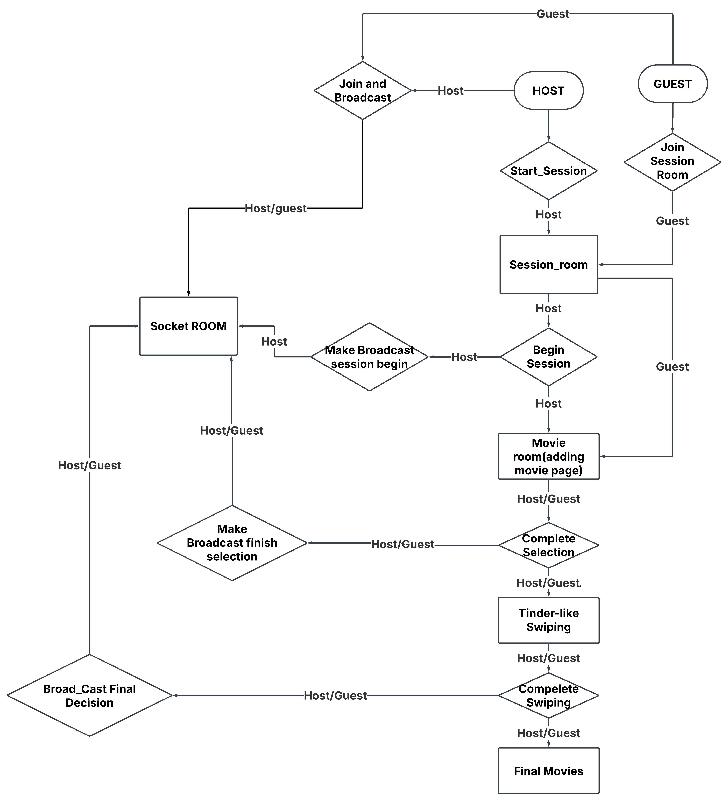

# Movie Swipe App

## Introduction
This is the final project for CS506. The app allows friends to **(`start a session/join a group`)** and use a Tinder-like swiping mechanism to vote for which movie to watch together. The goal is to make movie selection fun, interactive, and democratic among friends. ~~movies.db being used is put in the **google drive CS506** (`Project/Setup tables in Database/movies.db`)~~, ~~also since the **session_route_html_test is too large to push**, put in CS506 (`Project/session_route_html_test`)~~ , a new compiled version of all the html functionalities for testing use the name is called **(`complete_version_html_testing.html`)**, a new structured database will be in **google drive CS506** **(`Project/Setup tables in Database/movies_v2.db`)**

## Version Control
- Python Version: Conda 3.10.0
- Install dependencies using:
  ```sh
  pip install -r requirements.txt
  ```

## Setup Instructions
1. Clone the repository:
   ```sh
   git clone https://github.com/Steal-Your-Data/backend.git
   ```
2. Create and activate a Conda environment (optional but recommended):
   ```sh
   conda create --name movie-swipe-app python=3.10.0
   conda activate movie-swipe-app
   ```
3. Install dependencies:
   ```sh
   pip install -r requirements.txt
   ```
4. Run the application:
   ```sh
   python app.py
   ```

## High Level Workflow Diagram



## Potential Modification of the Database
---

### 1. Update the `MoviePocket` Model in `models.py`

Since we need to implement add functions when we encounter a case where there is no such a movies in the database. Thus there will be slightly modification on the code.

Firstly, Modify the `MoviePocket` class in your Flask application to include the new columns:

```python
from flask_sqlalchemy import SQLAlchemy

db = SQLAlchemy()

class MoviePocket(db.Model):
    __tablename__ = 'movie_pocket'
    id = db.Column(db.Integer, primary_key=True)
    session_id = db.Column(db.Text, db.ForeignKey('session.id'), nullable=False)
    movie_id = db.Column(db.Integer, db.ForeignKey('movies.id'))
    votes = db.Column(db.Integer, default=0)

    # New columns (nullable)
    title = db.Column(db.String(100))
    genres = db.Column(db.String(100))
    original_language = db.Column(db.String(10))
    overview = db.Column(db.Text)
    popularity = db.Column(db.Float)
    release_date = db.Column(db.Date)
    poster_path = db.Column(db.String(200))
```

In the database (`movies_v2.db`), also please change the table

```sqlite3
-- Drop the existing table if it exists
DROP TABLE IF EXISTS movie_pocket;

-- Create the new table with updated schema
CREATE TABLE movie_pocket (
    id INTEGER PRIMARY KEY,
    session_id TEXT NOT NULL REFERENCES session(id),
    movie_id INTEGER REFERENCES movies(id),
    votes INTEGER DEFAULT 0,
    title TEXT,
    genres TEXT,
    original_language TEXT,
    overview TEXT,
    popularity REAL,
    release_date DATE,
    poster_path TEXT
);
```

And also You might change the add_movies API in session_routes.py accordingly


## Contribution Guidelines
- Follow the Git branching workflow (`feature-branch`, `dev`, `main`).
- Use descriptive commit messages.
- Create pull requests for merging new features.

## License
This project is for educational purposes under CS506 and is not intended for commercial use.

## Contact
For any issues or contributions, please contact the development team via the repository's issue tracker.
